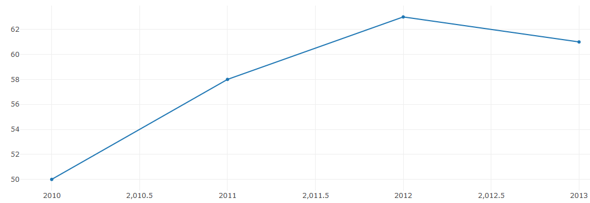

# GOAL

The goal of this project is to provide a simple way to load data from a json file and generate interactive plots in the most language agnostic manner. If possible all the steps needed to transform the data are described in a compact *template* text format that can be interpreted in various languages, such as javascript (for in-browser plots),  python and C++. 

**do we really need to support other languages than javascript ?** 
	
Not necessarly, but being able to reuse the same syntax to do json-to-tidyframe conversion from python (see section about tidy frames below) in order to do more complex processing with pandas for example would be a nice feature. The json to tidy frame templat could even be embeded in the json files.	
	

## Combining Plotly and JMESpath

[Plotly](https://plot.ly/) is an open-source javascript ploting library with interfaces in python and R. [JMESpath](http://jmespath.org/) is a json query language specification with implementation in various languages. 

By combining this two tool and some javadscipt we are able to create a page that allow to interatively generate plot from a json file in the browser fully on the client-side. Our small in browser protype is available [here].

The figure is described using the Ploly.js json format but the fields containing the data we want to plot are not array of numbers but strings starting with the $ character that correspond to JMESPAth queries in the data. 
Our javascript code walks through the json describing the figure and replace each string starting by $ by the result of the jmespah query on the data.

For example

data:
	
	[{"year":2010,"price":50},{"year": 2011,"price":58},{"year": 2012,"price":63},{"year": 2013,"price":61}]

*Plotly* fomat containing *JMESPath* queries :
	
	{
	"data":[{
		"x": "$[*].year",
		"y": "$[*].price",
		"mode": "lines+markers"
		}],
	"layout":{}
	}
gives:

## Converting json data to tidy frames

[Tidy dataframes](http://www.jeannicholashould.com/tidy-data-in-python.html) are dataframes formated in a specific way that makes data visualization easier. We could try to split the processing pipline into two step a json-to-tidyframe conversion and then tidy-frame-to-plot.

In order to assist in doing the conversion, could we use some automatization similar to [json2table](http://json2table.com) or [json-to-csv](https://konklone.io/json/) (code [here](https://github.com/konklone/json))?
bit we would need to port this tool to all the languages we want to target. 
 
## Alternatives

### supporting only javascript 

If  supporting python an c++ an python is not really a concern, what are the best tools to assist in creating plot using data from a json file ? and export the resulting generated code or template file ? 

### using python's pandas library

Using python to transform the json data into panda dataframes is not an option here we want to be able to make the conversion in the browser.
In the future there could be a port of pandas to javascript with the same API (maybe [panda-js](https://github.com/StratoDem/pandas-js)) and a declarative description format based on that API to describe a sequence of operations that be interpreted by pandas both in python and javascript. Or maybe we could run pandas in a python interpretor that run in the browser ? could https://github.com/iodide-project/pyodide/ be a viable option ?

### using SQL

Is there a client side SQL engine in javascript ? Is there an easy way to convert json to SQL data format ? 

### using XSLT

we could convert the json to xml using json-to-xml, use xslt to transform the data structure format that corresponds to plotly structure (bu in xml) and convert back to json using xml-to-json. There is an example of such an approach, without the plotly part [here](https://www.xml.com/articles/2017/02/14/why-you-should-be-using-xslt-30/)
For this approach to be language agnostic we could use json-to-from-xml converters in [javascript](https://goessner.net/download/prj/jsonxml/), [C++](https://github.com/Cheedoong/xml2json) and [python](https://pypi.org/project/xmljson/), but the conversion from and to json will need to be consistent accross languages. Also as visible [here](https://www.xml.com/articles/2017/02/14/why-you-should-be-using-xslt-30/) the xslt format is quite verbose. Are they interactive tools to assist in writing the xslt file? 

